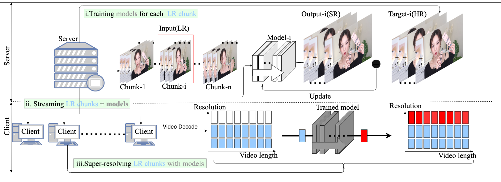
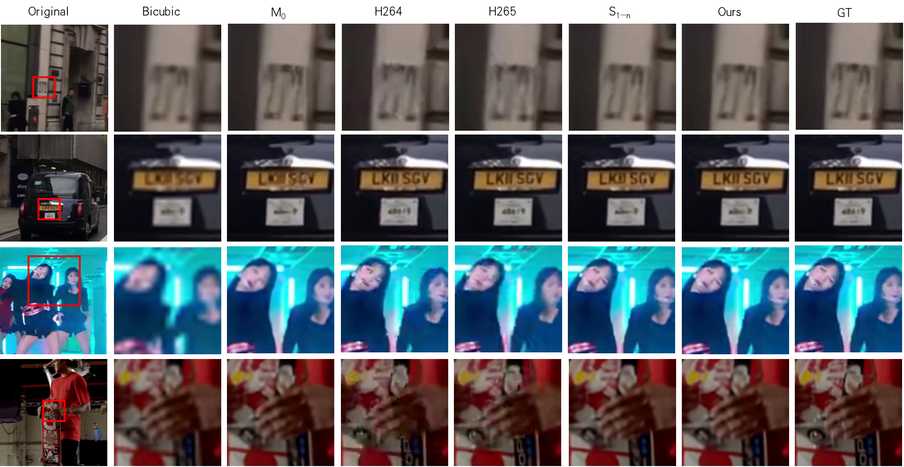

# CaFM-pytorch

## Introduction of dataset VSD4K
Our dataset VSD4K includes 6 popular categories: game, sport, dance, vlog, interview and city. Each category is consisted of various video length, including: 15s, 30s, 45s, etc. For a specific category and its specific video length, there are 3 scaling factors: x2, x3 and x4. In each file, there are HR images and its corresponding LR images. 1-n are training images , n - (n + n/10) are test images. (we select test image 1 out of 10). The dataset can be obtained from [https://pan.baidu.com/s/14pcsC7taB4VAa3jvyw1kog] (passward:u1qq) and google drive [https://drive.google.com/drive/folders/17fyX-bFc0IUp6LTIfTYU8R5_Ot79WKXC?usp=sharing].

```
e.g.:game 15s
dataroot_gt: VSD4K/game/game_15s_1/DIV2K_train_HR/00001.png
dataroot_lqx2: VSD4K/game/game_15s_1/DIV2K_train_LR_bicubic/X2/00001_x2.png
dataroot_lqx3: VSD4K/game/game_15s_1/DIV2K_train_LR_bicubic/X3/00001_x3.png
dataroot_lqx4: VSD4K/game/game_15s_1/DIV2K_train_LR_bicubic/X4/00001_x4.png
```
## Proposed method
### Introduction
Our paper __"Overfitting the Data: Compact Neural Video Delivery via Content-aware Feature Modulation"__ has been submitted to 2021 ICCV. we aim to use super resolution network to improve the quality of video delivery recently. The whole precedure is shown below. We devide the whole video into several chunks and apply a joint training framework with Content aware Feature Module(CaFM) to train each chunk simultaneously. With our method, each video chunk only requires less than 1% of original parameters to be streamed, achieving even better SR performance. We conduct extensive experiments across various SR backbones(espcn,srcnn,vdsr,edsr16,edsr32,rcan), video time length(15s-10min), and scaling factors(x2-x4) to demonstrate the advantages of our method. 
All pretrain models(15s, 30s, 45s) of game category can be found in this link [https://pan.baidu.com/s/1P18FULL7CIK1FAa2xW56AA] (passward:bjv1) and google drive link [https://drive.google.com/drive/folders/1_N64A75iwgbweDBk7dUUDX0SJffnK5-l?usp=sharing]. 

 

Figure 1. The whole procedure of adopting content-aware DNNs for video delivery. A video is first divided into several chunks and the server trains one model for each chunk. Then the server delivers LR video chunks and models to client. The client runs the inference to super-resolve the LR chunks and obtain the SR video.

### Quantitative results
We show our quantitative results in the table below. For simplicity, we only demonstrate the results on game and vlog datasets. We compare __our method M{1-n}__ with M0 and S{1-n}. The experiments are conducted on EDSR.
* M0: a EDSR without CaFM module, train on whole video.
* Si: a EDSR without a CaFM module, train on one specific chunk i.
* __M{1-n}ours__: a EDSR with n CaFM modules, train on n chunks simultaneously.

| Dataset |   | Game15s |   |   | Game30s |   |   | Game45s |   |
| :---: | :---: | :----: | :---: | :---: | :---: | :---: | :----: | :---: | :---: |
| Scale | x2 | x3 | x4| x2 | x3 | x4 | x2 | x3 | x4 |
| M0 | 42.24 | 35.88 | 33.44 | 41.84 | 35.54 | 33.05 | 42.11 | 35.75 | 33.33 |
| S{1-n} | 42.82 | 36.42 | 34.00 | 43.07 | 36.73 | 34.17 | 43.22 | 36.72 | 34.32 |
| __M{1-n} Ours__ | 43.13 | 37.04 | 34.47 | 43.37 | 37.12 | 34.58 | 43.46 | 37.31 | 34.79 |

| Dataset |   | Vlog15s |   |   | Vlog30s |   |   | Vlog45s |   |
| :---: | :---: | :----: | :---: | :---: | :---: | :---: | :----: | :---: | :---: |
| Scale | x2 | x3 | x4| x2 | x3 | x4 | x2 | x3 | x4 |
| M0 | 48.87 | 44.51 | 42.58 | 47.79 | 43.38 | 41.24 | 47.98 | 43.58 | 41.53 |
| S{1-n} | 49.10 | 44.80 | 42.83 | 48.20 | 43.68 | 41.55 | 48.48 | 44.12 | 42.12 |
| __M{1-n} Ours__ | 49.30 | 45.03 | 43.11 | 48.55 | 44.15 | 42.16 | 48.61 | 44.24 | 42.39 |
### Quatitative results
We show the quatitative results in the figure below.
* bicubic: SR images are obtained by bicubic
* H.264/H.265: use the default setting of FFmpeg to generate the H.264 and H.265 videos




## Dependencies
* Python >= 3.6
* Torch >= 1.0.0
* opencv-python
* numpy
* skimage
* imageio
* matplotlib
## Quickstart
M0 demotes the model without Cafm module which is trained on the whole dataset. S{1-n} denotes n models that trained on n chunks of video. M{1-n} demotes one model along with n Cafm modules that trained on the whole dataset. __M{1-n} is our proposed method__.


### How to set data_range
n is the total frames in a video. We select one test image out of 10 training images. Thus, in VSD4K, 1-n is its training dataset, n-(n+/10) is the test dataset. Generally, we set 5s as the length of one chunk. Hence, 15s consists 3 chunks, 30s consists 6 chunks, etc. 
| Video length(train images + test images) | chunks | M0/M{1-n} | S1 | S2 | S3 | S4 | S5 | S6 | S7 | S8 | S9 |
| :---: | :---: | :---: | :----: | :---: | :---: | :---: | :---: | :----: | :---: | :---: | :---: | 
| 15s(450+45) | 3 | 1-450/451-495 | 1-150/451-465 | 151-300/466-480 | 301-450/481-495 | - | - | - | - | - | - | 
| 30s(900+95) | 6 | 1-900/901-990 | 1-150/901-915 | 151-300/916-930 | 301-450/931-945 | 451-600/946-960 | 601-750/961-975 | 751-900/976-990 | - | - | - | 
| 45s(1350+135) | 9 | 1-1350/1351-1485 | 1-150/1351-1365 | 151-300/1366-1380 | 301-450/1381-1395 | 451-600/1396-1410 | 601-750/1411-1425 | 751-900/1426-1440 | 901-1050/1441-1455 | 1051-1200/1456-1470 | 1201-1350/1471-1485 | 


### Train
For simplicity, we only demonstrate how to train 'game_15s' by our method.

* __For M{1-n} model__: 
```
CUDA_VISIBLE_DEVICES=3 python main.py --model {EDSR/ESPCN/VDSRR/SRCNN/RCAN} --scale {scale factor} --patch_size {patch size} --save {name of the trained model} --reset --data_train DIV2K --data_test DIV2K --data_range {train_range}/{test_range} --cafm --dir_data {path of data} --use_cafm --batch_size {batch size} --epoch {epoch} --decay {decay} --segnum {numbers of chunk}
```
```
e.g. 
CUDA_VISIBLE_DEVICES=3 python main.py --model EDSR --scale 2 --patch_size 48 --save trainm1_n --reset --data_train DIV2K --data_test DIV2K --data_range 1-450/451-495 --cafm --dir_data /home/datasets/VSD4K/game/game_15s_1 --use_cafm --batch_size 64 --epoch 500 --decay 300 --segnum 3
```

You can apply our method on your own images. Place your HR images under YOURS/DIV2K_train_HR/, with the name start from 00001.png. 
Place your corresponding LR images under YOURS/DIV2K_train_LR_bicubic/X2, with the name start from 00001_x2.png. 
```
e.g.:
dataroot_gt: YOURS/DIV2K_train_HR/00001.png
dataroot_lqx2: YOURS/DIV2K_train_LR_bicubic/X2/00001_x2.png
dataroot_lqx3: YOURS/DIV2K_train_LR_bicubic/X3/00001_x3.png
dataroot_lqx4: YOURS/DIV2K_train_LR_bicubic/X4/00001_x4.png
```
* The running command is like: 
```
CUDA_VISIBLE_DEVICES=3 python main.py --model {EDSR/ESPCN/VDSRR/SRCNN/RCAN} --scale {scale factor} --patch_size {patch size} --save {name of the trained model} --reset --data_train DIV2K --data_test DIV2K --data_range {train_range}/{test_range} --cafm --dir_data {path of data} --use_cafm --batch_size {batch size} --epoch {epoch} --decay {decay} --segnum {numbers of chunk}
```

* For example:
```
e.g. 
CUDA_VISIBLE_DEVICES=3 python main.py --model EDSR --scale 2 --patch_size 48 --save trainm1_n --reset --data_train DIV2K --data_test DIV2K --data_range 1-450/451-495 --cafm --dir_data /home/datasets/VSD4K/game/game_15s_1 --use_cafm --batch_size 64 --epoch 500 --decay 300 --segnum 3
```

### Test
For simplicity, we only demonstrate how to run 'game' category of 15s. All pretrain models(15s, 30s, 45s) of game category can be found in this link [https://pan.baidu.com/s/1P18FULL7CIK1FAa2xW56AA] (passward:bjv1) and google drive link [https://drive.google.com/drive/folders/1_N64A75iwgbweDBk7dUUDX0SJffnK5-l?usp=sharing]. 

* __For M{1-n} model__: 
```
CUDA_VISIBLE_DEVICES=3 python main.py --data_test DIV2K --scale {scale factor} --model {EDSR/ESPCN/VDSRR/SRCNN/RCAN} --test_only --pre_train {path to pretrained model} --data_range {train_range} --{is15s/is30s/is45s} --cafm  --dir_data {path of data} --use_cafm --segnum 3
```
```
e.g.:
CUDA_VISIBLE_DEVICES=3 python main.py --data_test DIV2K --scale 4 --model EDSR --test_only --pre_train /home/CaFM-pytorch/experiment/edsr_x2_p48_game_15s_1_seg1-3_batch64_k1_g64/model/model_best.pt --data_range 1-150 --is15s --cafm  --dir_data /home/datasets/VSD4K/game/game_15s_1 --use_cafm --segnum 3
```

## Additional

We also demonstrate our method in vimeo dataset and HEVC test sequence. These datasets and all trained models will be released as soon as possible. By the way, we add SEFCNN.py into our backbone list which is suggested by reviewer.The code will be updated regularly.
